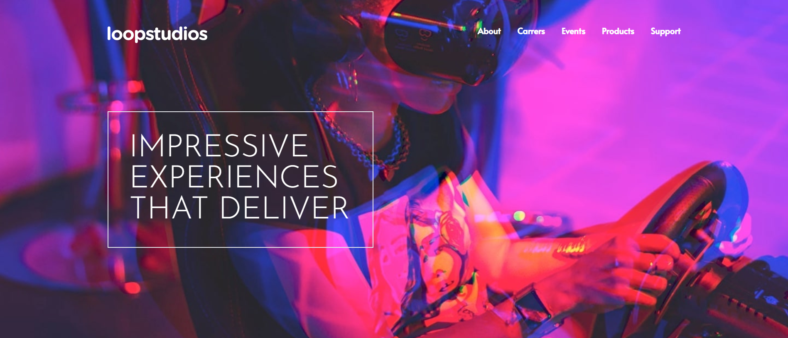
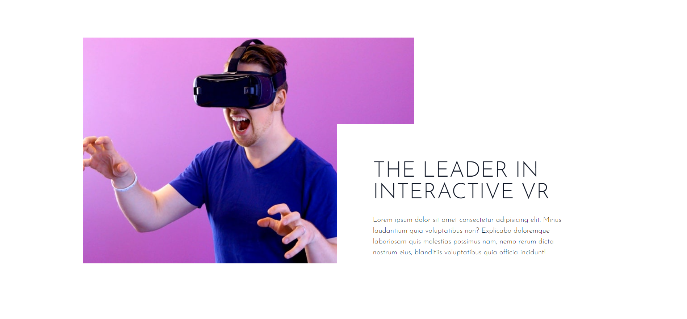
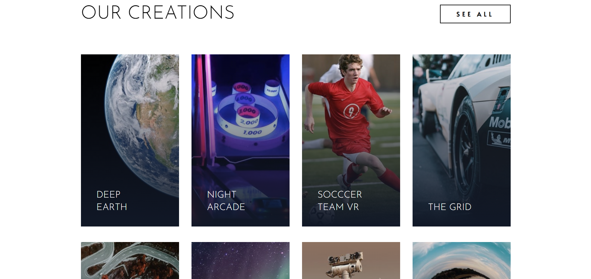
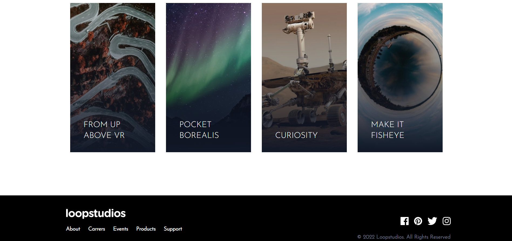
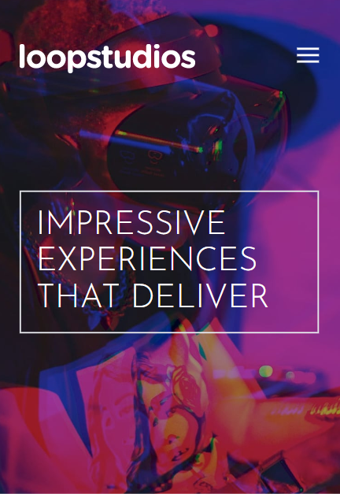
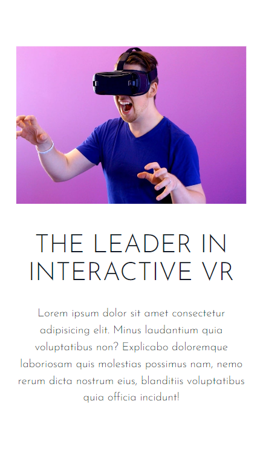
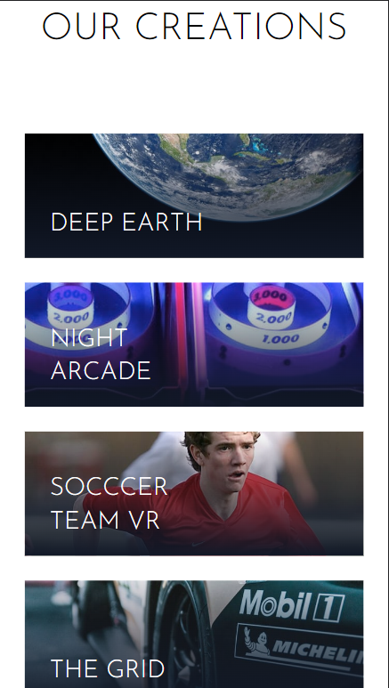
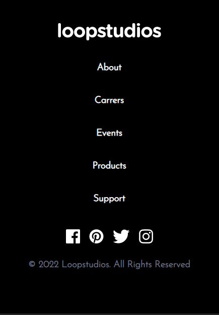

# Loop-Studio

## Table of Contents
* [Overview](#overview)
* [Process](#process)
* [References](#references)
* [Author](#author)

## Overview
> loop-studio is a modern VR website design with responsive layout. This project was taken as a challenge from [Frontend Mentor](https://www.frontendmentor.io/challenges/loopstudios-landing-page-N88J5Onjw).

### Screenshots
#### 1) Desktop

#### 2) Mobile  
 

 

 

 

### You can watch Live demo [_here_](https://loop-studio-ochre.vercel.app/).

## Process

### Built With
- HTML
- CSS
- Tailwind CSS

### What I Learned
- In the process of making this project i majorly learned to implement CSS using TailwindCSS in addition with, how to use grid and flexbox. 
- Learned how to display images for desktop and mobile seperately.
- Learned to make website responsive with help of TailwindCSS. 
- Also, learned to make hamburger menu (only visible for mobile devices).

## References
- [TailwindCSS](https://tailwindcss.com/)
- [MDN](https://developer.mozilla.org/en-US/)
- [w3schools](https://www.w3schools.com/)

## Author

[Website](https://kedarmakode.com/)

[Linkedin](https://www.linkedin.com/in/kedar-makode-9833321ab)

[Twitter](https://twitter.com/Kedar__98)

[Instagram]()

kedarmakode1598@gmail.com

